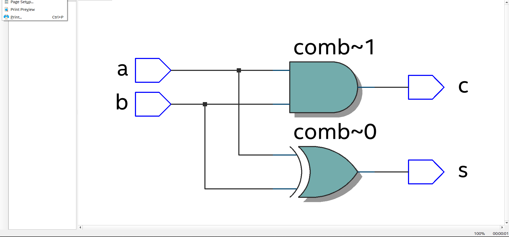

# Exp-02-Implementation-of-Half-Adder-and-Full-Adder-circuit

# Implementation-of-Half-Adder-and-Full-Adder-circuit
### AIM:
To design a half adder and full adder circuit and verify its truth table in Quartus using Verilog programming.

### Equipments Required:
Hardware – PCs, Cyclone II , USB flasher
Software – Quartus prime
Theory
Adders are digital circuits that carry out addition of numbers.

### Half Adder
Half adder is a combinational circuit that performs simple addition of two binary numbers. The input variables designate the augend and addend bits; the output variables produce the sum and carry. It is necessary to specify two output variables because the result may consist of two binary digits.

Sum = A’B+AB’ =A ⊕ B Carry = AB

### Full Adder
Full adder is a digital circuit used to calculate the sum of three binary bits. It consists of three inputs and two outputs. Two of the input variables, denoted by A and B, represent the two significant bits to be added. The third input, Cin, represents the carry from the previous lower significant position. Two outputs are necessary because the arithmetic sum of three binary digits ranges in value from 0 to 3, and binary 2 or 3 needs two digits. The two outputs are sum and carry.

Sum =A’B’Cin + A’BCin’ + ABCin + AB’Cin’ = A ⊕ B ⊕ Cin Carry = AB + ACin + BCin

 

#### Figure -01 HALF ADDER 


#### Figure -02 FULL ADDER 

### Procedure

1.Using xor,and,not,or gates and wires ,construct Half Adder.

2.Repeat same steps to construct for Full Adder.

3.Find RTL logic and timing diagram for both Adders.

4.End the program


### Program:
```
#half adder
module half_adder(a,b,s,c);
input a,b;
output s,c;
xor(s,a,b);
and(c,a,b);
endmodule

#full adder
module fulladd(a,b,c,sum,carry);
input a,b,c;
output sum,carry;
assign sum=((a^b)^c);
assign carry=((a&b)|(b&c)|(c&a));
endmodule
```
/*
Program to design a half adder and full adder circuit and verify its truth table in quartus using Verilog programming.
Developed by:yoheshkumar R.M
RegisterNumber: 22008459 
*/
Logic symbol & Truthtable
RTL realization

### Output:
### RTL
1:

2:


### TIMING DIAGRAM
1:

2:


### TRUTH TABLE 
1:

2:


### Result:
Implementation of Half Adder and Full Adder circuit is completed.